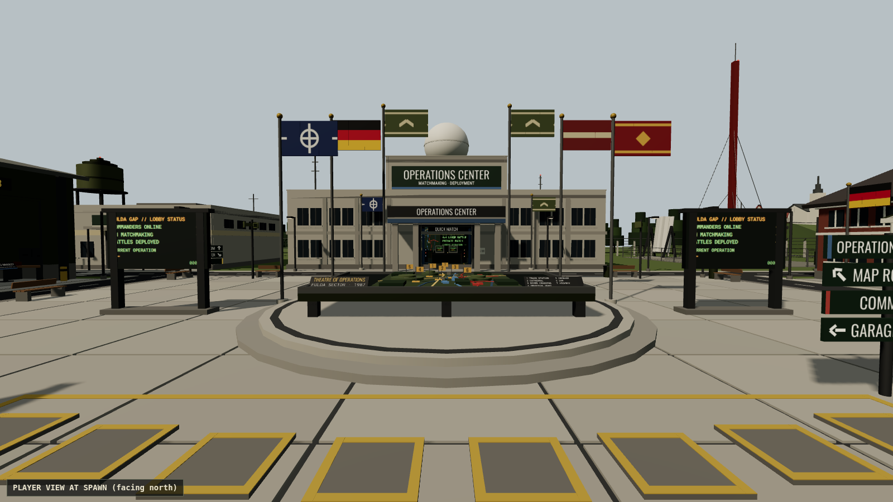
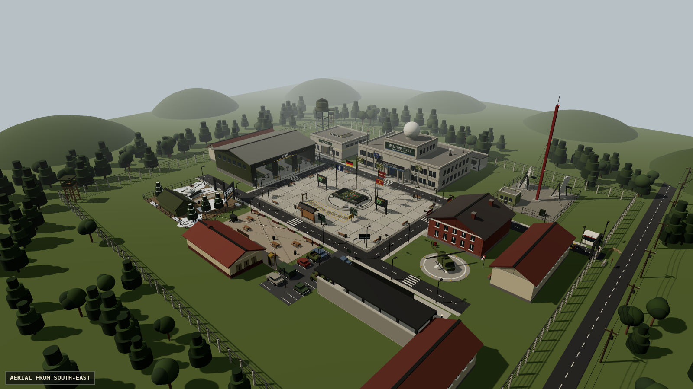

# Cold War RTS — Main Lobby

The main lobby for a late-Cold-War RTS on Roblox: a NATO forward command base
in the Fulda Gap where every system is a place you walk to. Queue for a battle
at a terminal in the Operations Center, study maps in the Map Room, look at
vehicles in the Garage, check the Hall of Commanders, and pick up orders at the
Mission Board. Low-poly, semi-realistic and muted in colour: olive, concrete,
brown and faded red and blue.




| Area | What you do there |
|---|---|
| **Parade square** (spawn) | Central 3D theatre map of the Fulda sector, flags, live lobby status pylons, signposts, a notice board |
| **Operations Center** | Matchmaking terminals: QUICK MATCH, 1v1, 2v2, 4v4 and PRIVATE (access codes, host picks size and map). A command wall with a live deployment board. Signals room and briefing room |
| **Map Room** | Seven battle map displays (name, size, terrain, recommended players, landmark) and a planning table with a 3D miniature. Set your preferred map |
| **Command HQ** | Commander file (rank, level, credits), service records, customisation (allegiance, title, insignia) and the Hall of Honour (achievements) |
| **Garage** | Six vehicles you can inspect (the camera orbits them), the unit registry (collection and unlocks) and the paint shop (camouflage) |
| **Hall of Commanders** | Leaderboards: TOP COMMANDERS, MOST VICTORIES, MOST MATCHES, MOST TERRITORY CAPTURED, CURRENT SEASON |
| **Event Area** | A replaceable seasonal operation (currently OPERATION IRON WINTER, 23 days left on the test date) with challenges, a reward track and a limited unit |
| **Mission Board** | Daily orders ("Capture 10 sectors", "Win 3 matches", "Play 5 different maps", "Complete a team battle") and orientation orders for new players |
| **Canteen** | A social courtyard with picnic tables, string lights and a fire barrel |
| **Around the base** | Gate checkpoint, guard towers, barracks, motor pool, comms compound, helipad with a parked helicopter, staff parking, a village beyond the fence |

The layout is compact. In the headless navigation test every entrance is
within **8.7 s** of spawn at walking speed, and every interaction within
**11.6 s**.

## Put it into your place (Place1)

**Important:** this project was built and tested headlessly. It has **not been
opened in Roblox Studio yet**. Please run the checks in
[docs/STUDIO_TEST_PLAN.md](docs/STUDIO_TEST_PLAN.md) the first time you open it.

### Option A: open the baked place (quickest)
1. Open `dist/ColdWarLobby.rbxl` in Roblox Studio. The whole base is already
   in Workspace, so you can walk it in edit mode.
2. Press **Play** to try it.
3. **File → Publish to Roblox As…** Pick your game. Publishing over an
   existing place (such as Place1) replaces that place's contents.

### Option B: sync into Place1 with Rojo
1. Install [Rojo](https://rojo.space) 7.x and its Studio plugin.
2. Run `rojo serve` in this folder, open Place1 in Studio and click
   **Connect** in the Rojo plugin. Scripts sync into `ReplicatedStorage.Lobby`,
   `ServerScriptService.LobbyServer` and
   `StarterPlayer.StarterPlayerScripts.LobbyClient`.
3. Press **Play**. The server builds the lobby at startup. The template
   `Baseplate` and `SpawnLocation` are moved (not deleted) to
   `ServerStorage.LobbyDisplacedTemplate`, because they would clash with the
   lobby's ground and spawn pads.
4. To see and edit the lobby without playing, "bake" it once from the
   command bar:
   ```lua
   require(game.ServerScriptService.LobbyServer.World.Builder).Build()
   ```
   A baked lobby is reused at runtime while its `LobbyVersion` attribute
   matches `Builder.Version`. If you change the builders, bake again.

### Option C: copy the containers
Open `dist/ColdWarLobby.rbxl`, copy `Workspace.ColdWarLobby`,
`ReplicatedStorage.Lobby`, `ServerScriptService.LobbyServer`,
`StarterPlayer.StarterPlayerScripts.LobbyClient` and
`ServerStorage.LobbyAssets`, then paste each into the same service in Place1.

## Using Fulda Gap assets without changing that game

The lobby builds its own low-poly vehicles, but it uses real game models
when you provide them:

1. Open the Fulda Gap place, select a vehicle model and **copy** it (Ctrl+C).
   Copying leaves the source game unchanged. Don't save anything there.
2. In Place1, paste it into `ServerStorage.LobbyAssets.Units`. Create the two
   folders if they don't exist.
3. Rename it to the unit id (`M1_ABRAMS`, `T72`, `BMP2`…) or to a model key
   (`MBT_WEST`, `TRUCK_EAST`…). The ids are in
   `src/shared/Config/Units.luau`.

The Garage showcase, the event unit, the registry previews, the motor pool and
the parking lot then use the copy. It is scaled to fit, anchored, and has its
scripts removed so no game logic from the RTS runs in the lobby.

## Configuration (all in `src/shared/Config`)

| What | Where |
|---|---|
| Teleport to the RTS place | `GameModes.luau` → `Settings.TargetPlaceId`. While it is 0, or when running in Studio, deployment is simulated in the lobby. Otherwise the match is teleported to a reserved server with teleport data `{ source, mode, map, teams = { {userIds}, {userIds} }, private }` |
| Modes, queue sizes, countdown | `GameModes.luau` |
| Maps (texts + top-down previews + theatre positions) | `Maps.luau` |
| Units, camouflage schemes, unlock prices/levels | `Units.luau` |
| Daily and orientation missions | `Missions.luau` |
| Seasonal events | `Events/` — add a module like `IronWinter.luau` and list it in `Events/init.luau`. The Event Area structure is permanent; only the dressing and texts change |
| Leaderboards | `Leaderboards.luau` |
| Levels, ranks, titles, insignia, achievements | `Progression.luau` |
| Colours and fonts | `Theme.luau` |
| Sounds (Creator Store IDs) | `Sounds.luau` |

### Data
- Profiles are stored in DataStore `ColdWarLobby_Commanders_v1`, key
  `commander_<userId>`.
- Leaderboards use OrderedDataStores `ColdWarLobby_LB_v1_<BOARD>`.
- In Studio without API access, profiles are temporary and seeded with demo
  stats (this is labelled in the UI).
- **For the RTS match servers:** report results by updating the same profile
  key with `UpdateAsync`. Increment `stats.matches`, `stats.victories`,
  `stats.defeats`, `stats.sectorsCaptured`, `stats.unitsDestroyed`,
  `stats.teamBattles`, `stats.playMinutes`, `stats.rating`, and the
  `stats.mapsPlayed[mapId]` / `stats.victoriesByMap[mapId]` counters, plus
  `xp` and `credits`.
- When the lobby saves it merges instead of overwriting: stats keep the higher
  value, and credits and XP are applied as deltas. Match results written while
  a player is in the lobby are therefore not lost. Missions and event
  challenges read these stats.

## Controls
- **Keyboard / mouse:** walk up to a station and press **E** (or click the
  prompt). **Esc** closes a panel, and walking away also closes it. **L**
  toggles the locator.
- **Gamepad:** **X** interacts, **B** closes, **LB/RB** switch tabs,
  **D-pad down** toggles the locator.
- **Touch:** tap the prompt plate; panels have a CLOSE button.

## Project layout
```
src/shared   Config (modes, maps, units, missions, events, theme, sounds),
             Interactions registry, Net (remotes), Util (Format, MapDraw, Signal)
src/server   init.server.luau (bootstrap)
             World/      Builder, Kit, Architecture, Ground, Perimeter, Nature,
                         Vehicles, Props, Effects, Zones/, Stations/, Details/
             Core/       pure logic: profiles, missions, queues, garage, trackers
             Services/   Setup, Data, Commander, Interaction, Mission, Event,
                         Garage, Matchmaking, Leaderboard, LobbyStatus
src/client   init.client.luau, State, UI/ (Kit, WindowManager, Panels/, Hud/),
             Controllers/ (prompts, camera, mission board), Ambient/
tests        Lune harness + specs per phase (see below)
tools        bake.luau (dist place), render/ (preview renderer)
```

## Verification

Everything below runs headlessly in [Lune](https://lune-org.github.io/docs):
```
./scripts/check.sh              # rojo build + luau-lsp strict type check + stylua
lune run tests/run.luau         # 80 test cases → build/test-report.md
lune run tools/bake.luau        # rebuild dist/ColdWarLobby.rbxl
node tools/render/render.mjs build/render/detailing.json build/previews/p overview
```
The harness loads the Rojo-built place, emulates the engine services the code
uses, and runs the real server and client scripts against each other through
the remotes. The specs cover:
- layout, scale and walkability (2.5D navigation from spawn to every entrance
  and prompt), spawn safety and sightlines
- render budgets: parts, lights, SurfaceGui pixels, particles
- the muted palette
- that every prop rests on the floor and never cuts into geometry
- every interaction and panel
- matchmaking (1v1, 2v2, 4v4, quick and private), teleport data, missions,
  leaderboards, events and the garage
- DataStore failure modes and save merging
- ambient animation, sound and flyby, and UI feedback
- code hygiene, and that the baked place matches the source and boots

The preview images in `docs/previews` come from an approximate three.js
renderer. They are not Roblox renders.

## Not verified yet
Things only Roblox itself can confirm are listed in
[docs/STUDIO_TEST_PLAN.md](docs/STUDIO_TEST_PLAN.md), each with the manual
test to run:
- real rendering and lighting
- fonts
- input devices
- audio levels
- DataStores in a published place
- teleport to the RTS place
- performance on phones
- streaming
